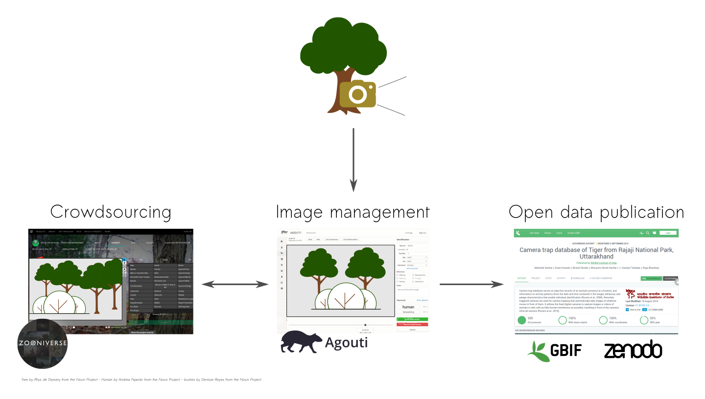

---
title:
---

Welcome on the CATREIN page

The Catrein project wants to facilitate and enhance wildlife research using camera traps in Belgium.

For this purpose investments are done both in hardware (> 60 Reconyx Hyperfire HC 600 cameras) and in software. The [Agouti] (www.agouti.eu) software allows users to manage surveys, annotate images, archive images and data and produce standard reports using metadata standards. 

We aim to create a community of researchers using camera traps in Belgium and facilitate their research by sharing knowledge on practical aspects such as camera types and field protocols as well as by providing and sharing scripts (e.g. R language) allowing standardized data analysis and reporting. By performing standardized analysis in R for camera trap users unfamiliar with this kind of data analysis we hope to encourage them to use the [Agouti](www.agouti.eu) platform and bridge the gap between camera trap use and wildlife research. 

Next, by the integration of [Agouti](www.agouti.eu) with the [Zooniverse](https://www.zooniverse.org/) citizen science platform, we enable citizen science projects and allowe citizens to identify species, sex and age.

Providing the ability to publishing the collected data as open data allows to share the results of camera trap research in Belgium with other researchers abroad. 

